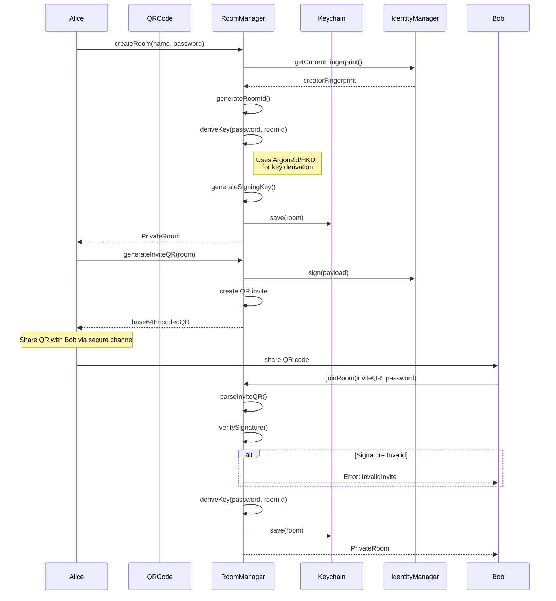
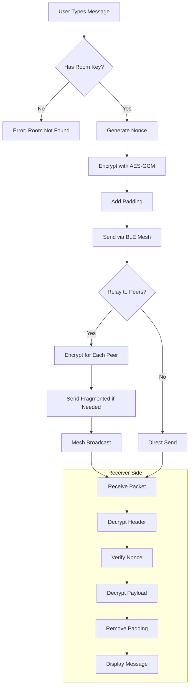
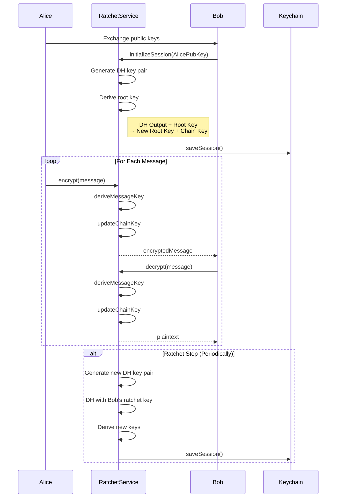
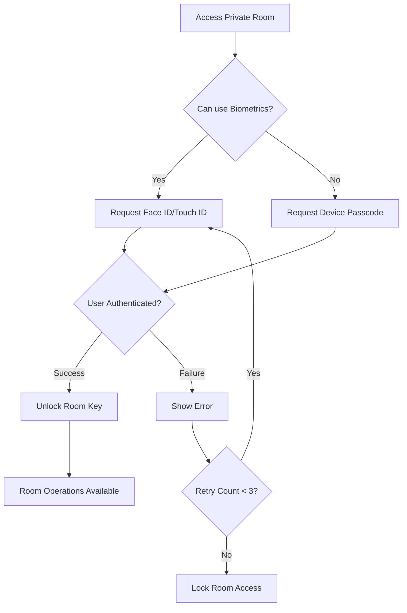
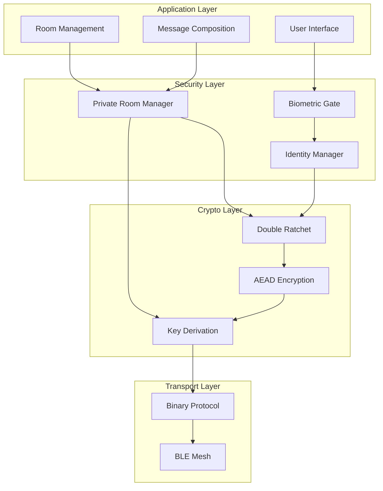
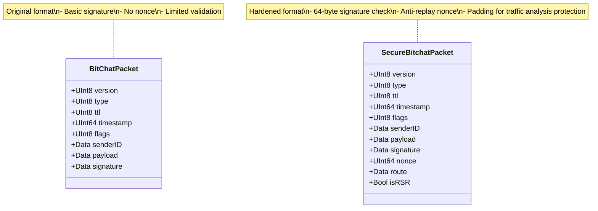

# SecureBitchat Architecture Diagrams

## Secure Room Join Flow

## Message Encryption Flow

## Double Ratchet Key Exchange

## Key Rotation Timeline

```mermaid
gantt
    title Key Rotation Schedule
    dateFormat X
    axisFormat %s
    
    section Ephemeral Keys
    Identity Key Generation    :0, 50
    Key in Use                :50, 3500
    Rotation Check            :3500, 3600
    New Key Generation        :3600, 3650
    Key in Use                :3650, 7150
    
    section Room Keys
    Room Created              :100, 200
    Member Joins              :1500, 1600
    Rekey Triggered           :1600, 1700
    New Room Key Distributed   :1700, 1800
    
    section Ratchet
    Message 1 Key             :500, 600
    Message 2 Key             :600, 700
    Message 3 Key             :700, 800
    Ratchet Step              :800, 900
    Message 4 Key             :900, 1000
```

## Biometric Authentication Flow

## Security Layer Architecture

## Packet Format Comparison

